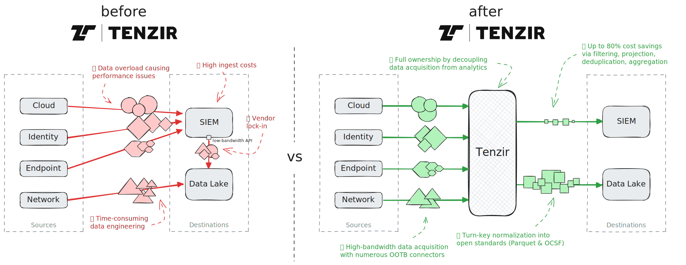

# Overview

### Tenzir is the data pipeline engine for security teams

**Why Tenzir?** Tenzir decouples data acquisition from downstream analytics,
giving you full control over your data flows. By using Tenzir as your data
pipeline, you can streamline and trim your security events down to the essence,
significantly reducing SIEM costs.

**Building a security data lake?** Tenzir serves as your ETL layer, delivering
data as your lake requires it. Our growing [open-source library of
packages](https://github.com/tenzir/library) includes turn-key integrations for
popular security products and mappings to [OCSF](https://schema.ocsf.io). Don't
use your precious security resources to do mundane data plumbing. We got this.

**Join the community!** Tenzir is more than just software: it's a
community-driven open-source project. Contribute, collaborate, and
[join](/discord) our mission to make working with security simple and enjoyable!

  

    

      

        

          <h3>Ready to Dive in?</h3>
        

        

          

          Get your fingers dirty and explore the demo node with just a few
          clicks and a guided tour. Security data has never been easier.
          

        

        

          <a class="button button--primary button--block" href="tutorials/quickstart">Quickstart</a>
        

      

    

    

      

        

          <h3>New to Tenzir?</h3>
        

        

          

            Learn the basics of pipelines and get familiar with the Tenzir
            Query Language (TQL). You'll master security data in no time.
          

        

        

          <a class="button button--primary button--block" href="pipelines">Pipelines</a>
        

      

    

  

## Documentation Types

Our documentation consists of four different types of materials, each of which
addresses a specific user need.

- **How-To Guide**: Practical step-by-step explanation to help you achieve a
  specific goal. Most useful when you're trying to get something done.
- **Reference**: Nitty-gritty technical descriptions of how Tenzir works. Most
  useful when you need detailed information about Tenzir's building blocks.
- **Explanation**: Big-picture explanations of higher-level Tenzir concepts.
  Most useful for building understanding of a particular topic.
- **Tutorial**: Learning-oriented lesson that take you through a series of steps
  to complete a project. Most useful when you want to get started with Tenzir.

:::tip Need help?
We're here to help! If you have any questions, swing by our
friendly [community Discord](/discord) or open a [GitHub
discussion](https://github.com/tenzir/tenzir/discussions).
:::
