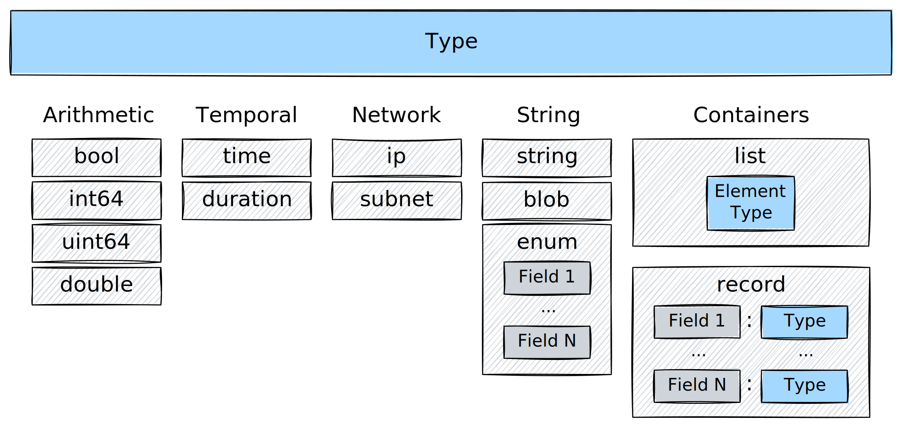

# Types

Tenzir's type system is a superset of JSON. That is, every valid JSON object is
a valid Tenzir value, but there also additional types available, such as `ip`
and `subnet`.

## Terminology

The diagram below illustrates the type system at a glance:

### Basic Types

Basic types are stateless types with a static structure. The following basic
types exist:

| Type       | Description
| ---------- | --------------------------------------
| `none`     | Denotes an absent or invalid value
| `bool`     | A boolean value
| `int64`    | A 64-bit signed integer
| `uint64`   | A 64-bit unsigned integer
| `double`   | A 64-bit double (IEEE 754)
| `duration` | A time span (nanosecond granularity)
| `time`     | A time point (nanosecond granularity)
| `string`   | A UTF-8 encoded string
| `blob`     | An arbitrary sequence of bytes
| `ip`       | An IPv4 or IPv6 address
| `subnet`   | An IPv4 or IPv6 subnet

### Complex Types

Complex types are stateful types that carry additional runtime information.

#### Enumeration

The `enum` type is a list of predefined string values. It comes in handy for
low-cardinality values from a fixed set of options.

Tenzir implements an `enum` as an Arrow Dictionary.

#### List

The `list` type is an ordered sequence of values with a fixed element type.

Lists have zero or more elements.

#### Record

The `record` type consists of an ordered sequence *fields*, each of which have a
name and type. Records must have at least one field.

The field name is an arbitrary UTF-8 string.

The field type is any Tenzir type.

### Optionality

All types are optional in that there exists an additional `null` data point in
every value domain. Consequently, Tenzir does not have a special type to
indicate optionality.

### Attributes

Every type has zero or more **attributes**, which are free-form key-value pairs
to enrich types with custom semantics.

## Comparison to Arrow

All Tenzir types have a lossless mapping to [Arrow](http://arrow.apache.org)
types, however, not all Arrow types have a Tenzir equivalent. As a result, it is
currently not yet possible to import arbitrary Arrow data. In the future, we
plan to extend our support for Arrow-native types and also offer conversion
options for seamless data handover.

Tenzir has a few domain-specific types that map to Arrow [extension
types][extension-types]. These are currently `enum`, `ip`, and `subnet`. Tenzir
and Arrow attach type metadata to different entities: Tenzir attaches metadata
to a type instance, whereas Arrow attaches metadata to a schema or record field.

[extension-types]: https://arrow.apache.org/docs/format/Columnar.html#extension-types

:::tip More on Arrow & Tenzir
If you want to learn more about why Tenzir uses Apache Arrow, read our
[two](/blog/apache-arrow-as-platform-for-security-data-engineering) [blog
posts](/blog/parquet-and-feather-enabling-open-investigations) that explain why
we build on top of Arrow.
:::
